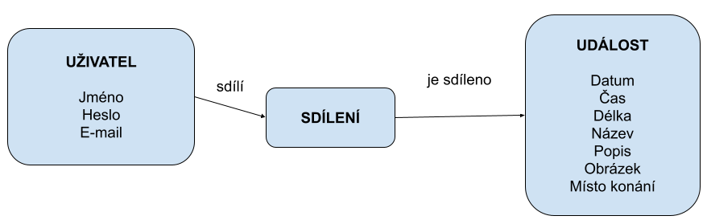

# Základní Funkční Požadavky

## Přihlášení a Registrace Uživatelů
- Umožnit uživatelům vytvářet účty a přihlašovat se.

## Správa Kalendáře
- Přidávání, úprava, mazání událostí.

## Zobrazení Kalendáře
- Různé zobrazení (den, týden, měsíc).

## Upozornění
- Posílání upozornění na nadcházející události.

## ER Diagram

# Charakteristika Funkčností Aplikace

## Přizpůsobitelnost
- Umožnit uživatelům přizpůsobit zobrazení kalendáře.

## Integrace s Jinými Kalendáři
- Možnost importovat události z jiných kalendářových služeb.

## Uložení rozpracované události
- Po načtení stránky se neztratí data.

# Specifikace Uživatelských Rolí a Oprávnění

## Správce
- Správa uživatelských účtů a přístupu k systémovým nastavením.

## Editor
- Možnost vytvářet a upravovat události.

## Čtenář
- Pouze prohlížení událostí.

# Uživatelské Grafické Rozhraní a Jeho Funkčnosti

## Přehledný Kalendář
- Čisté a intuitivní rozhraní. Možnost úpravy fontu a barev správcem.

## Nástroje pro Správu Událostí
- Jednoduché rozhraní pro správu událostí.

## Responzivní Design
- Aplikace bude funkční na různých zařízeních.

## Integrace do Webové Stránky
- Například jako widget do WordPressu.
